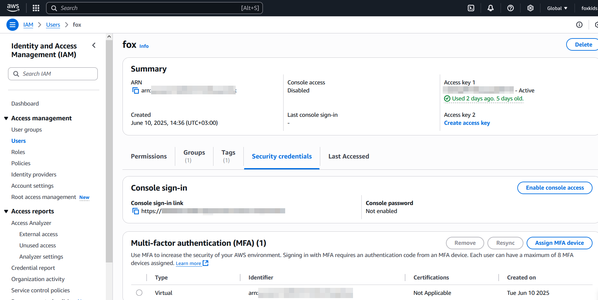

# RS School Task 1: AWS Account Configuration and Infrastructure Setup using Terraform and AWS

## Description:
This project is part of the RS School DevOps course. It demonstrates setting up cloud infrastructure using AWS CLI, Terraform, IAM, and GitHub Actions for managing Terraform state and secure deployments.

## Prerequisites:
- AWS Account
- AWS CLI v2
- Terraform
- GitHub account
- Git installed

## 1. Install AWS CLI and Terraform:
Instructions AWS CLI: https://docs.aws.amazon.com/cli/latest/userguide/install-cliv2.html
Instructions Terraform: https://developer.hashicorp.com/terraform/downloads

## 2. Create IAM User and Configure MFA:

1. Go to AWS Console → IAM → Users → Add User
2. Attach these policies:
    - AmazonEC2FullAccess
    - AmazonRoute53FullAccess
    - AmazonS3FullAccess
    - IAMFullAccess
    - AmazonVPCFullAccess
    - AmazonSQSFullAccess
    - AmazonEventBridgeFullAccess
3. Configure MFA for both root and new user.

MFA for user "fox":



4. Generate Access Key and Secret Key.

## 3. Configure AWS CLI:
```
aws configure
```

## Verify AWS CLI connection:
```
aws ec2 describe-instance-types --instance-types t4g.nano
```

## 4. Create a Github repository for your Terraform code :

- https://github.com link
- New repository
- Repository name: "rsschool-devops-course-tasks"
- Visibility: Public

## 5. Create a bucket for Terraform states:

s3.tf
```
resource "aws_s3_bucket" "terraform_state" {
  bucket = var.bucket_name
}
```

variables.tf
```
variable "bucket_name" {
  description = "My S3 bucket for Terraform state"
  type        = string
  default     = "my-terraform-state-bucket-00100"
}
```

## 6. Create an IAM role for Github Actions(Additional task)
Best practices link:
- [Terraform resource](https://registry.terraform.io/providers/hashicorp/aws/latest/docs/resources/iam_role)


## 7. Configure an Identity Provider and Trust policies for Github Actions(Additional task)
Documentation:
- [IAM roles terms and concepts](https://docs.aws.amazon.com/IAM/latest/UserGuide/id_roles.html#id_roles_terms-and-concepts)
- [Github tutorial](https://docs.github.com/en/actions/security-for-github-actions/security-hardening-your-deployments/configuring-openid-connect-in-amazon-web-services)
- [AWS documentation on OIDC providers](https://docs.aws.amazon.com/IAM/latest/UserGuide/id_roles_create_for-idp_oidc.html#idp_oidc_Create_GitHub)

## 8. Create a Github Actions workflow for deployment via Terraform
Create `.github/workflows/terraform.yml` with 3 jobs:

- `terraform-check`: Run `terraform fmt`
```
jobs:
  terraform-check:
    runs-on: ubuntu-latest
    steps:
      - name: Checkout 
        uses: actions/checkout@v4
      - name: Set up Terraform
        uses: hashicorp/setup-terraform@v1
      - name: Format Terraform code
        run: terraform fmt -check
```
- `terraform-plan`: Run `terraform plan`
```
jobs:
  terraform-plan:
    runs-on: ubuntu-latest
    needs: terraform-check
    steps:
      - name: Checkout 
        uses: actions/checkout@v4
      - name: Set up Terraform
        uses: hashicorp/setup-terraform@v1
      - name: Initialize Terraform
        run: terraform init
        env:
          AWS_ACCESS_KEY_ID: ${{ secrets.AWS_ACCESS_KEY_ID }}
          AWS_SECRET_ACCESS_KEY: ${{ secrets.AWS_SECRET_ACCESS_KEY }}
          AWS_REGION: eu-central-1
      - name: Terraform Plan
        run: terraform plan -input=false
        env:
          AWS_ACCESS_KEY_ID: ${{ secrets.AWS_ACCESS_KEY_ID }}
          AWS_SECRET_ACCESS_KEY: ${{ secrets.AWS_SECRET_ACCESS_KEY }}
          AWS_REGION: eu-central-1
```
- `terraform-apply`: Run `terraform apply`
```
jobs:
  terraform-apply:
    runs-on: ubuntu-latest
    needs: terraform-plan
    steps:
      - name: Checkout
        uses: actions/checkout@v4
      - name: Set up Terraform
        uses: hashicorp/setup-terraform@v1
      - name: Initialize Terraform
        run: terraform init
        env:
          AWS_ACCESS_KEY_ID: ${{ secrets.AWS_ACCESS_KEY_ID }}
          AWS_SECRET_ACCESS_KEY: ${{ secrets.AWS_SECRET_ACCESS_KEY }}
          AWS_REGION: eu-central-1
      - name: Terraform Apply
        run: terraform apply -auto-approve -input=false
        env:
          AWS_ACCESS_KEY_ID: ${{ secrets.AWS_ACCESS_KEY_ID }}
          AWS_SECRET_ACCESS_KEY: ${{ secrets.AWS_SECRET_ACCESS_KEY }}
          AWS_REGION: eu-central-1
```

## Author

This project is part of the [RS School DevOps Course](https://github.com/rolling-scopes-school/tasks/tree/master/devops) :fire:

Task by: [@gantsevich-yuri](https://github.com/gantsevich-yuri)


